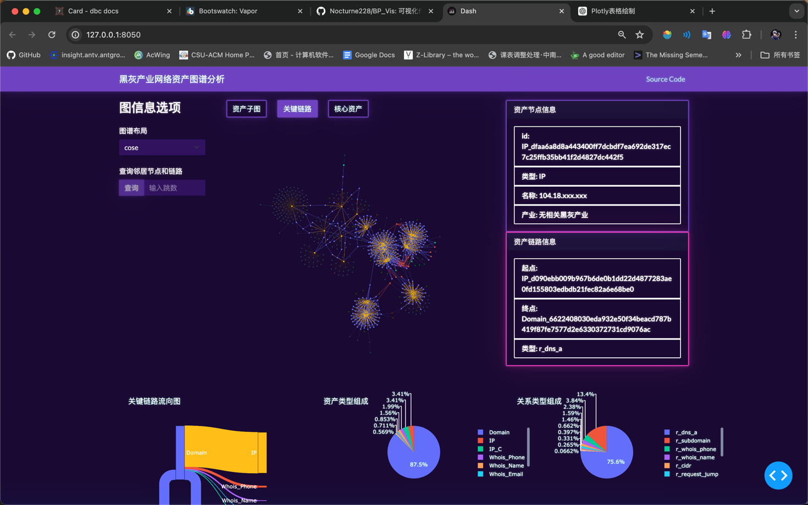

# 黑灰产业网络资产可视化应用

使用Plotly Dash开发应用，主要包括plotly.express, dash, dash-cytoscape, dash-bootstrap-component

# 运行

`git clone git@github.com:Nocturne228/BP_Vis.git`

`cd BP_VIS`

`pip install requirements.txt`

`python app.py`

运行在本地8050端口

http://127.0.0.1:8050/

# 界面

